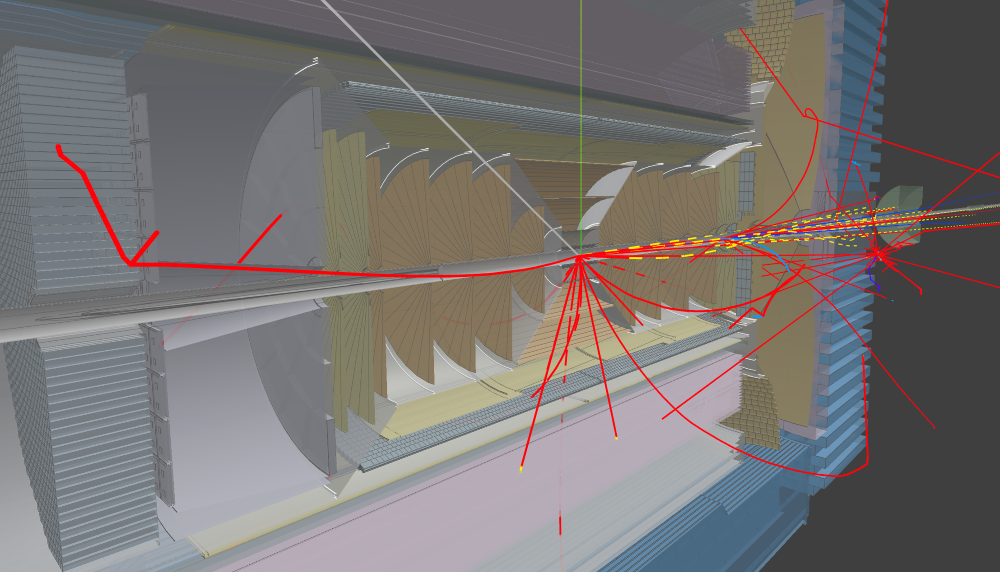

# Phoenix DD4Hep

Plugin for DD4Hep that allows to dump trajectories then convert to Phoenix json format.




## Usage

1. First one has to build DD4Hep plugin and ensure it is discoverable (e.g. `LD_LIBRARY_PATH` is pointing on it 
   or it is installed in system libraries)

    ```bash
    git clone https://github.com/HSF/phoenix-dd4hep.git
    cd phoenix-dd4hep
    mkdir build && cd build
    
    # This will create prefix/lib folder after the install
    cmake ..
        
    make && make install
    
    # Make sure the library and .components file are discoverable:
    export LD_LIBRARY_PATH="$(pwd)/prefix/lib${LD_LIBRARY_PATH:+:$LD_LIBRARY_PATH}"
    ```
   
2. Now you need to configure DD4Hep. The plugin comes with a stepping action `TextDumpingSteppingAction`
   The configuration is done like: 

   ```python
   # Instantiate the stepping action
   stepping = DDG4.SteppingAction(kernel, 'TextDumpingSteppingAction/MyStepper')
   stepping.OutputFileName = "my_output.txtevt"
   stepping.OnlyPrimary = False   # configure what to save (see below)
   # ... 
   kernel.steppingAction().add(stepping)
   ```
   
   For the convenience an example steering file is enclosed in this project. 
   You can copy it, change the settings and use in simulations by `--steeringFile` flag:

   ```bash
   cp phoenix-dd4hep/steering.py my_steering.py
   ddsim --steeringFile=my_steering.py --compactFile=geometry -N=100 --outputFile=sim_output.edm4hep.root --inputFiles sim_input.hepmc   
   ```
   
   This will produce `sim_output.txtevt` file with simple text file containing steps info    
   > for large events or e.g. if optical photons are saved, such file could easily be gigabytes in size

3. Convert resulting text file to phoenix.json format. One can use a script `dd4hep_txt_to_phoenix.py` for that
 
   ```bash
   python3 phoenix-dd4hep/dd4hep_txt_to_phoenix.py -o result.phoenix.json sim_output.txtevt
   ```
   
   This will produce tracks file in phoenix json format
    
## Configuration

So far the next parameters can be configured through python

```bash


```

 
    

### Run simulation for 10 events
#### (!) Using *.edm4hep.root in the output is mandatory

```bash
ddsim --steeringFile=steering.py --compactFile=$DETECTOR_PATH/epic.xml -N=100 --outputFile=sim_output.edm4hep.root --inputFiles sim_input.hepmc
```

***Example 10 events***

```bash
python3 test_stepping.py --compactFile=$DETECTOR_PATH/epic.xml -N=10 --outputFile=sim_output.edm4hep.root --inputFiles /mnt/d/data/firebird/pythia8CCDIS_18x275_minQ2-100_beamEffects_xAngle-0.025_hiDiv_1.hepmc
```

## EIC specific example

EIC openly provides docker images as well as sample data. Docker/singularity images aka eic_shell
ships all standard HENP stack, such as ROOT, Geant4, DD4Hep, Acts etc.  

One can start this example simply by [eic_shell](https://eic.github.io/tutorial-setting-up-environment/index.html) or
[eicweb/eic_xl](https://hub.docker.com/r/eicweb/eic_xl/tags) docker image: 

```bash
docker pull eicweb/eic_xl:nightly
docker run --rm -it -v /host/where/phoenix-dd4hep:/mnt/phoenix-dd4hep -v /host/place/with/data:/mnt/data eicweb/eic_xl:nightly
```

```bash
# Build dd4hep plugin and install to system root
cd /mnt/phoenix-dd4hep
mkdir build && cd build && cmake ..
make && make install 
cd ..

# Make sure the library and .components file are discoverable:
export LD_LIBRARY_PATH="/mnt/phoenix-dd4hep/prefix/lib${LD_LIBRARY_PATH:+:$LD_LIBRARY_PATH}"
    
# Use the default ePIC detector for DD4HEP
source /opt/detector/epic-main/bin/thisepic.sh

# Copy example steering file
cp /mnt/phoenix-dd4hep/steering.py /mnt/data/
# edit parameters of /mnt/data/steering.py

# Copy example hepmc3 input file
xrdcp root://dtn2001.jlab.org:1094//work/eic2/EPIC/EVGEN/CI/pythia8NCDIS_5x41_minQ2=1_beamEffects_xAngle=-0.025_hiDiv_1_20ev.hepmc3.tree.root /mnt/data/test.hepmc3.tree.root

# Run DDSIM 10 events
ddsim --steeringFile=/mnt/data/steering.py --compactFile=$DETECTOR_PATH/epic.xml -N=10 --outputFile=/mnt/data/sim_output.edm4hep.root --inputFiles /mnt/data/test.hepmc3.tree.root

# Convert to phoenix
python3 dd4hep_txt_to_phoenix.py -o /mnt/data/result.phoenix.json /mnt/data/sim_output.evt.txt
```

